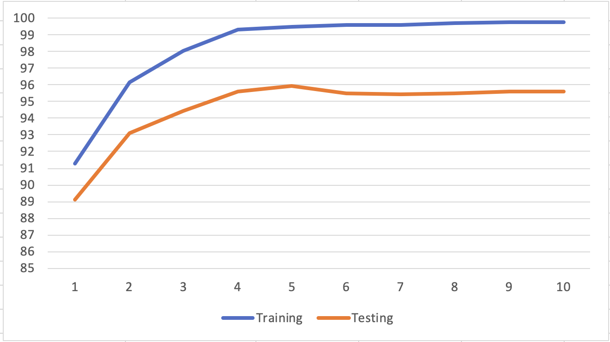

# Multi-Language-Classifier

Requires Java 9+

The goal of this is to combine a lot of the various techniques in machine learning, 
some of which I have learned in detail in my classes, and some of these have just been touched upon.

The techniques I'm going to explore:
  - genetic algorithms, used in feature selection
  - decision trees (detailed in class), a basic method of determining, but works for multiple output values
  - boosting, specifically adaboost (detailed in class), a method of weighting other learning algorithms and inputs to learn better
  - neural networks (parts are detailed, parts are not)
  
Feature selection:
  - specific words (the, a, an, and their equivalents)
    - mutation: pick a new word, given the entire list of words, with the proportional probability to the word count
    - crossover: blends don't make sense, so just return one of the parents
  - a word ends with a sequence of characters
    - mutation: add/remove a random character, drawn from the distribution of letters
    - crossover: all sub-sequences from the two suffixes blended
  - a word starts with a sequence of characters
    - mutation & crossover is similar to word endings
  - a word contains a sequence of characters
    - mutation & crossover is similar to word endings and starts
  - letter count of one letter greater than another letter
    - mutation: one letter changes according to the distribution of letters
    - crossover: the 4 combinations of two letter combinations
  
Multiple classification:
  - since there's many languages to decide between, I'm going to use binary classifiers in a one vs one approach.
  - requires training `K (K − 1) / 2` binary classifiers, and then taking the number of +1 votes on each classification, the one with the max is the language decided.

What to learn:
  - figure out which language a phrase is, learning from examples from wikipedia's random page links.
  
The languages I'm going to try to classify:
  - Albanian: https://sq.wikipedia.org/wiki/Speciale:Rast%C3%ABsishme
  - Croatian: https://hr.wikipedia.org/wiki/Posebno:Slu%C4%8Dajna_stranica
  - Czech: https://cs.wikipedia.org/wiki/Speci%C3%A1ln%C3%AD:N%C3%A1hodn%C3%A1_str%C3%A1nka
  - Danish: https://da.wikipedia.org/wiki/Speciel:Tilf%C3%A6ldig_side
  - Dutch: https://nl.wikipedia.org/wiki/Speciaal:Willekeurig
  - English: https://en.wikipedia.org/wiki/Special:Random
  - French: https://fr.wikipedia.org/wiki/Sp%C3%A9cial:Page_au_hasard
  - Gaelic (Scottish): https://gd.wikipedia.org/wiki/S%C3%B2nraichte:Random
  - German: https://de.wikipedia.org/wiki/Spezial:Zuf%C3%A4llige_Seite
  - Hawaiian: https://haw.wikipedia.org/wiki/Papa_nui:Kaulele
  - Icelandic: https://is.wikipedia.org/wiki/Kerfiss%C3%AD%C3%B0a:Handah%C3%B3fsvalin_s%C3%AD%C3%B0a
  - Italian: https://it.wikipedia.org/wiki/Speciale:PaginaCasuale
  - Romanian: https://ro.wikipedia.org/wiki/Special:Aleatoriu
  - Samoan: https://sm.wikipedia.org/wiki/Special:Random
  - Spanish: https://es.wikipedia.org/wiki/Especial:Aleatoria
  
These languages are strategically chosen:
  - They all have latin characters
     - Distinguishing between languages with different character sets is trivial
  - All have wikipedia pages with "Random Article" links, which I can scrape for examples
     - I really only know English and a very small amount of Spanish.

Given a phrase in one of the languages below, the program can detect and correctly classify the language, using machine learning techniques on training data.

## Results

The above graph shows the tree depth and accuracy.
This is with just the following features implemented:
  - genetic algorithm for feature selection
  - word matching feature
  - letter frequency feature
  - word ending feature
  - word starting feature
  - decision trees learning
  
The above shows that the accuracy is just short of 95%
with the testing.txt file, using the training.txt for learning.

Overfitting starts to play a part once the depth of the trees exceeds 6.

Each iteration of the training took around 3 seconds.

